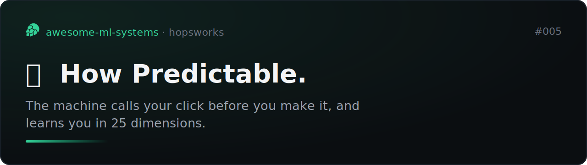
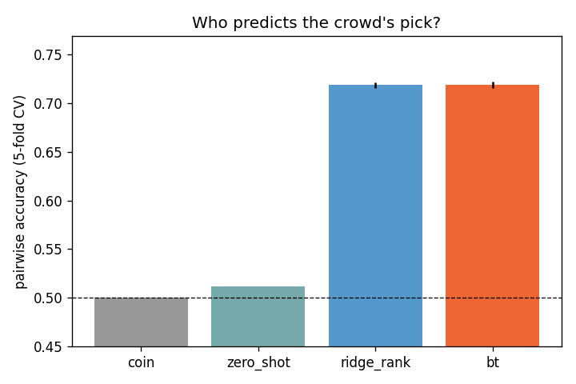
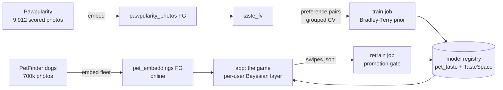
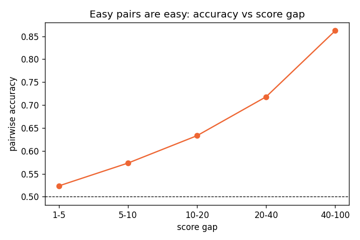
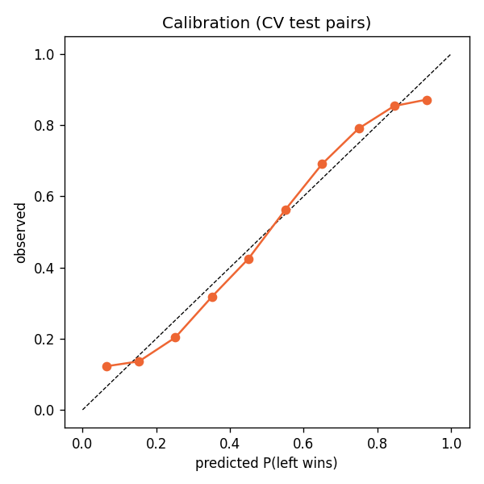

# how predictable.



Two pets. Click the one you like. The machine has already guessed which one
you'll pick, and the line at the top shows how often it reads you right. It
starts near a coin flip and climbs as it learns you: that line is the product.



## What it shows

Online per-user preference learning on top of a crowd prior, as a game:

- A **crowd model** (Bradley-Terry logistic head on frozen image embeddings)
  trained on 9,912 PetFinder photos with real engagement scores (Kaggle
  Pawpularity). It knows what everyone likes.
- A **per-user Bayesian layer** that starts as the crowd and learns your delta,
  one swipe at a time, in the app session. No account, no history: 25
  parameters, updated in closed form per click.
- The UI plots both: the frozen crowd model and your personalized model, on the
  same swipes. The gap between the curves is what the machine learned about you.

Supervised online preference learning. Not RL: nothing optimizes which pets you
see for engagement; active selection maximizes information about your taste.

## The two design decisions that matter

**Personalization happens in 25 dimensions, not 768.** A swipe carries roughly
one dimension of information, so 30 swipes cannot pin a 768-weight model.
The per-user layer works on phi(x) = [crowd logit, top-24 pool PCs] with prior
mean [1, 0, ..., 0]: "start as the crowd, learn where you disagree".
Simulation before any deployment: crowd model flat at 61%, personalized 71%
by swipe 20-30, 77% by 50.

**The accuracy line only counts random pairs.** Two of three pairs are chosen
actively (highest posterior uncertainty: they teach the model most). Actively
chosen pairs are harder than average, so scoring them would corrupt the metric.
Every third pair is uniform random and is the only one the accuracy line sees.
Train pairs train, measure pairs measure.

## FTI pipelines



Feature, training and inference pipelines are independent programs joined
through the Hopsworks feature store. The v1 app serves inference in-process
(the model is a weight vector; a KServe endpoint would wrap a dot product in
an HTTP hop). The day "upload your own pet" ships, the frozen encoder moves
behind a real KServe deployment.

The app itself is a custom server-rendered FastAPI service (no Streamlit, no
front-end framework, no CDN). The model's pick for the current pair never
leaves the server, so devtools cannot cheat the accuracy line.

## Honest numbers

Crowd model, 9,912 scored photos, preference pairs with score gap >= 10,
grouped 5-fold CV (no photo on both sides of a split):

| model | pairwise accuracy |
|---|---|
| coin flip | 0.500 |
| zero-shot appeal prompts (CLIP, no training) | 0.511 |
| ridge score-then-rank | 0.718 |
| Bradley-Terry head (champion) | **0.719 +/- 0.003** (AUC 0.786) |

Encoder shoot-out on the same task (3,000-photo subset): SigLIP 0.714,
DINOv2 0.708, CLIP B/32 0.691. SigLIP is pinned; the DINOv2 gap is within
noise, the CLIP gap is not.




Caveats, loud:

- The Bradley-Terry head and ridge-then-rank are statistically tied on
  accuracy. BT stays champion because the game needs calibrated pair
  probabilities (the "72% sure" number), which ranking scores do not give.
- Text prompts know what a pet is but not what the crowd likes: the zero-shot
  floor is a coin flip. All the signal is in the embedding geometry, none in
  the prompt.
- Pawpularity scores are population-level photo appeal, not any individual's
  taste. The crowd model is the floor the personal layer must beat, per session.
- Preference pairs with score gap < 10 are noise and are excluded from
  training; accuracy vs gap is in the model card.
- The pool photos are 2023 PetFinder shelter listings (dataset license
  unknown, dataset card on HF: `drzraf/petfinder-dogs`). Non-commercial demo.

## Rebuild

```
make pawpularity      # needs kaggle token + accepted competition rules
make benchmark-job    # pins the encoder in taste_features.py
make embed-fleet      # petfinder zips -> embeddings + lead photos
make insert           # parquets -> FGs + FV
make train-job        # prior + baselines -> model registry
make app              # the game
make retrain-job      # flywheel (schedule daily)
```
