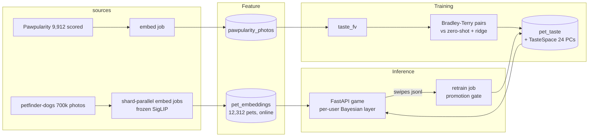
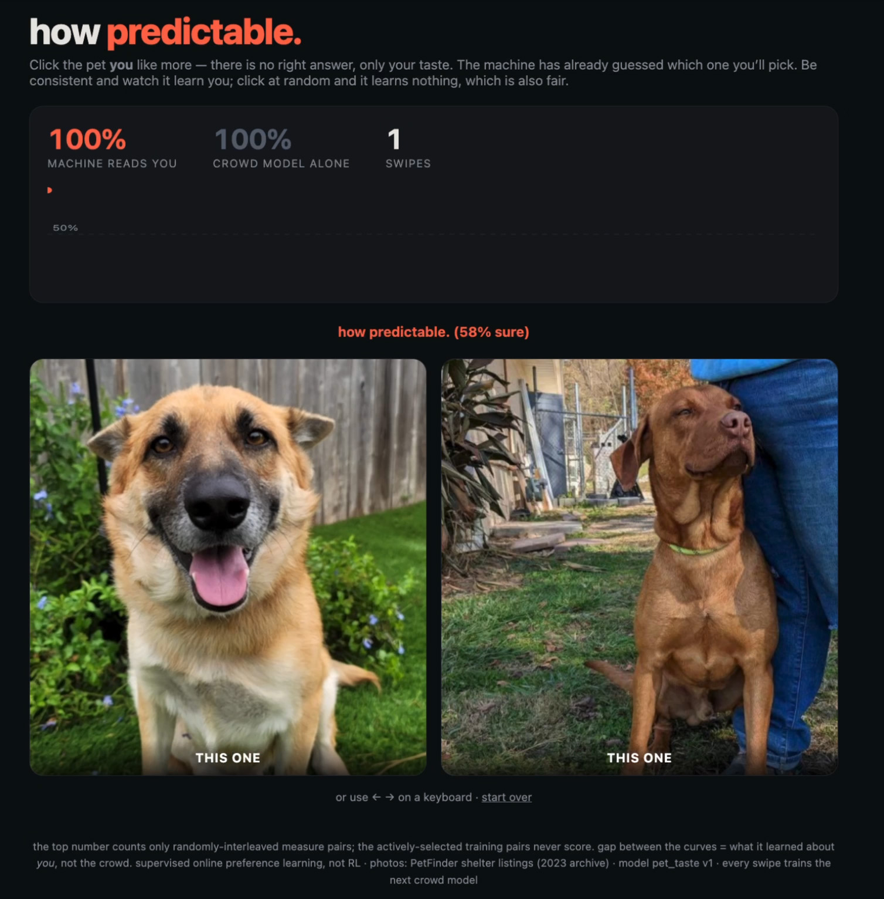

# how predictable.


[](https://github.com/MagicLex/awesome-ml-systems)
[](https://www.hopsworks.ai/)

Two pets. Click the one you like. The machine has already guessed which one
you'll pick, and the line at the top shows how often it reads you right: near a
coin flip when you arrive, climbing as a per-user Bayesian layer learns your
taste, one click at a time. The line is the product.

## The result

**The crowd is 71.9% predictable from pixels alone.** A Bradley-Terry logistic
head on frozen SigLIP embeddings, trained on preference pairs drawn from 9,912
Pawpularity-scored shelter photos, called the crowd's pick on held-out pairs
71.9% of the time. The zero-shot floor ("an adorable photo of a cute pet",
no training) is a coin flip: all the signal is in the embedding geometry,
none in the prompt.

Grouped 5-fold CV, score gap >= 10, no photo on both sides of a split:

| model | pairwise accuracy |
|---|---:|
| coin flip | 0.500 |
| zero-shot appeal prompts (CLIP) | 0.511 |
| ridge score-then-rank | 0.718 |
| **Bradley-Terry head (champion)** | **0.719 +/- 0.003** (AUC 0.786) |

Encoder shoot-out on the same task (3,000-photo subset): SigLIP 0.714,
DINOv2 0.708, CLIP B/32 0.691. SigLIP is pinned; the DINOv2 gap is within
noise, the CLIP gap is not.

**The per-user layer learns in 25 dimensions, not 768.** A swipe carries
roughly one dimension of information, so 30 swipes cannot pin a 768-weight
model. Personalization works on phi(x) = [crowd logit, top-24 pool PCs] with
prior mean [1, 0, ..., 0]: start as the crowd, learn where you disagree.
Simulated cold-start arc (before any deployment): crowd flat at 61%,
personalized 71% by swipe 20-30, 77% by 50. Active pair selection buys
+2.2 points of held-out accuracy at swipe 20 over random pairs.


## Caveats

Read these before quoting the number anywhere.

- **The accuracy line only counts random pairs.** Two of three pairs are chosen
  actively (highest posterior uncertainty: they teach most, and they are
  harder than average). Every third pair is uniform random and is the only one
  the line sees. Train pairs train, measure pairs measure.
- **The Bradley-Terry head and ridge-then-rank are statistically tied** on
  accuracy. BT stays champion because the game needs calibrated pair
  probabilities (the "72% sure" number), which ranking scores do not give.
- **Pawpularity is population-level photo appeal**, not any individual's
  taste. The crowd model is the floor the personal layer must beat, per
  session, on your own screen.
- **Supervised online preference learning, not RL.** Nothing optimizes which
  pets you see for engagement; active selection maximizes information about
  your taste. The true bandit (which pets to show) is explicitly v2.
- Preference pairs with score gap < 10 are noise and are excluded from
  training; accuracy vs gap ships in the model card.
- Pool photos are 2023 PetFinder shelter listings (license unknown, dataset
  card: HF `drzraf/petfinder-dogs`). Non-commercial demo.

## Architecture

An FTI (feature, training, inference) system on Hopsworks. Images become
vectors at the door: embed jobs stream the petfinder zips, keep the lead photo
per dog plus a 768-float vector, and never re-embed. The v1 app serves
inference in-process: the model is a weight vector, and the per-user half is
session state that can only live server-side anyway. A KServe endpoint returns
the day "upload your own pet" ships (frozen encoder at request time = genuinely
heavy = real predictor).



The app is a custom server-rendered FastAPI service (no Streamlit, no front-end
framework, no CDN). The model's pick for the current pair never leaves the
server, so devtools cannot cheat the line.

The file-by-file map:

```
collect/pawpularity.py       kaggle download                            (terminal)
pipelines/embed.py           zips -> SigLIP vectors + lead photos       (3 parallel jobs + 1)
pipelines/insert_fg.py       parquets -> FGs + FV                       (terminal)
pipelines/train.py           BT vs baselines -> registry + TasteSpace   (Hopsworks job)
pipelines/retrain.py         swipes -> challenger, promotion gate       (scheduled job)
app/server.py                the game: pair serving, posterior, line    (Hopsworks app)
taste_features.py            shared frozen-encoder embedding (no skew)
taste_online.py              TasteSpace + per-user Bayesian posterior
taste_pairs.py               one definition of a preference pair
tools/benchmark_encoders.py  clip/siglip/dinov2 shoot-out               (Hopsworks job)
```

## Reproduce

Clone into a Hopsworks project on the `/hopsfs/...` FUSE mount.

```bash
make pawpularity      # kaggle token + accepted competition rules required
make benchmark-job    # pins taste_features.ENCODER (siglip won)
make embed-fleet      # petfinder zips -> vectors + lead photos, parallel jobs
make insert           # parquets -> FGs + FV
make train-job        # BT prior + baselines -> model registry
make app              # the game
make retrain-job      # flywheel (schedule daily)
```

No GPU required anywhere: embedding is shard-parallel CPU jobs, heads are
logistic regressions on stored vectors, the game scores pairs with a dot
product.

## The demo

Two pets side by side. Before you click, the model has already made its secret
pick from your posterior; after, it either sneers "how predictable. (74%
sure)" or admits "you surprised the machine. it is taking notes." Two curves
grow: the frozen crowd model and the one learning you. The gap between them is
what the machine knows about you and nobody else. Every swipe is appended to
the feedback log, and a scheduled retrain folds the actively-selected train
pairs back into the crowd prior behind a promotion gate: hold the pawpularity
CV within one SE and beat the champion on live measure swipes, or no ship.


